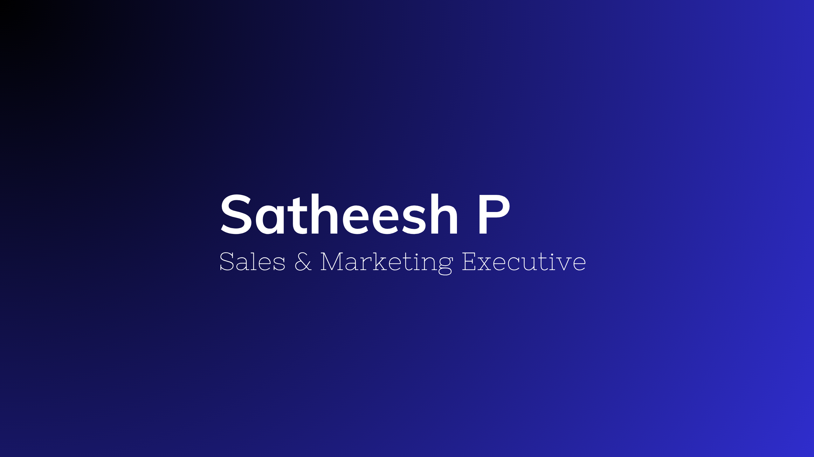

  

<h1 align="center">Hi 👋, I'm Satheesh P</h1>

<h3 align="center">Sales Manager | Business Development Specialist</h3>

  

  
  
  
  

---

# 👨‍💼 Profile

Results-driven Sales & Marketing Executive with 4+ years of experience in business development, lead generation, franchise sales, customer acquisition, and digital marketing.

Proven track record of generating qualified leads, building client relationships, increasing brand visibility, and driving business growth.

MBA graduate with strong communication, negotiation, and relationship management skills.

---

# 📞 Contact

📱 +91 8681002884

📧 Satheeshp2303@gmail.com

📍 Nagercoil, Tamil Nadu, India

💼 LinkedIn: www.linkedin.com/in/satheesh-p

---

# 💼 Work Experience

## First Step Franchise, India
### Sales & Digital Marketing Specialist
📅 Nov 2024 – Jun 2026

✅ Generated 500+ qualified franchise leads through digital marketing campaigns

✅ Converted 45+ leads into franchise partnerships with an 85% closure rate

✅ Managed Meta Ads campaigns and achieved 8,000+ monthly social media impressions

---

## Sea Trade, Maldives
### Sales & Marketing Executive
📅 Jun 2024 – Oct 2024

✅ Managed Facebook, Instagram, and WhatsApp marketing campaigns

✅ Generated 100+ customer inquiries through targeted promotional activities

✅ Coordinated with 20+ resort and business clients to support sales growth

---

## Annai Guest House, India
### Sales & Marketing Executive
📅 Aug 2023 – May 2024

✅ Increased customer inquiries by 40% through digital marketing initiatives

✅ Established partnerships with 50+ local vendors and tourism businesses

✅ Maintained 95%+ customer satisfaction through effective guest engagement

---

## Annai Guest House, India
### Marketing Executive
📅 Jun 2020 – Sep 2021

✅ Created 60+ promotional campaigns across social media platforms

✅ Generated 100+ booking inquiries through marketing and partnership activities

✅ Converted 50+ partnership leads into guest bookings and accommodations

---

# 🎓 Education

| Degree | Institution | Year |
|----------|----------|----------|
| MBA (Marketing & HR) | Anna University | 2021 - 2023 |
| BBA | MS University | 2017 - 2020 |

---

# 🏆 Certification

### JClick Solutions
Social Media Marketing Certification (2025)

---

# 🚀 Skills

---

# 🌐 Languages

 Tamil (Native)

 English (Professional)

 Malayalam (Professional)

---

# 📊 GitHub Stats

---

<h3 align="center">
⭐ Thank You For Visiting My Profile ⭐
</h3>
